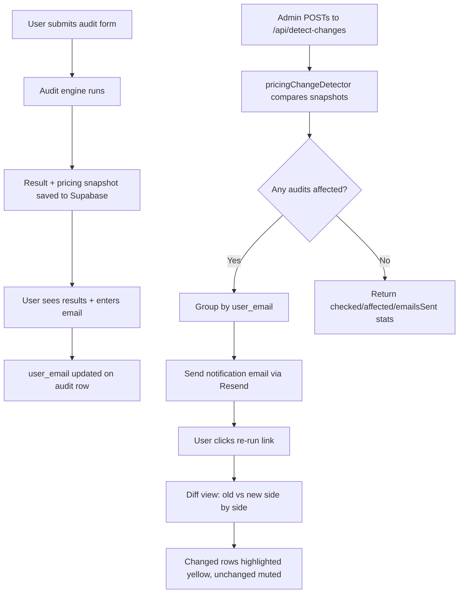

# Round 2: Re-Audit Feature with Pricing Change Detection

## What this PR does

This PR extends SpendSmart AI with a live re-audit system. Every audit is now persisted to Supabase with a pricing snapshot. When AI tool pricing changes, affected users are automatically notified via email with a diff view showing exactly what changed and why.

## Why

AI tool pricing changes frequently — Cursor, Claude, and Copilot have all restructured plans in the past 18 months. A one-time audit becomes misleading the moment pricing shifts. Users who acted on stale data could be making worse decisions than before they audited. This feature turns SpendSmart AI from a one-shot tool into a living advisor.

## How it works

When a user submits an audit, the result is saved to Supabase with a complete pricing snapshot. An admin triggers `POST /api/detect-changes` with a new price (e.g., `{"tool": "cursor", "new_price": 40}`). The `pricingChangeDetector.ts` compares stored snapshots against current pricing using JSON.stringify for deep comparison (not object reference). Affected audits are grouped by `user_email` — one consolidated email per user via Resend. Users click the re-run link to see `/audit/[id]/rerun` which loads old and new audit results side by side with changed rows highlighted in yellow.



## What I cut

- **Scheduled cron trigger**: Used manual `POST /api/detect-changes` instead. Vercel Cron is straightforward to add but costs a Pro plan upgrade — manual endpoint is functionally identical for this stage.
- **Live pricing persistence**: The detect-changes endpoint accepts a temporary price override for detection and notification. `pricingData.ts` itself is updated via manual file edit + redeploy. Production would write overrides to a Supabase `pricing_overrides` table and serve them dynamically across the app.
- **Admin dashboard**: Bonus feature. Deprioritized after the 4 required features worked end-to-end.
- **Styled unsubscribe page**: The `/api/unsubscribe` endpoint works and sets `unsubscribed=true` in Supabase, but returns plain text confirmation instead of a designed page. Cut for time.
- **"What changed this week" public page**: Bonus feature, not attempted in 36h.

## How to test it manually

1. Go to the deployed URL, fill the audit form: add Cursor Pro 1 seat $20/mo, Claude Pro 1 seat $20/mo, ChatGPT Plus 1 seat $20/mo. Team size 3, use case: coding.
2. Submit → you get audit results at `/audit/[uuid]`
3. Enter your email in the lead capture form on the results page
4. Check Supabase → `audits` table → confirm row exists with your email + `pricing_snapshot`
5. Trigger a pricing change via Postman or curl:
   ```bash
   POST [DEPLOYED_URL]/api/detect-changes
   Body: {"tool": "cursor", "new_price": 40}
   ```
6. Response should show: `{ checked: N, affected: N, emailsSent: 1 }`
7. Check inbox → email arrives with subject "Your AI Spend Audit Has New Recommendations"
8. Email shows: cursor pro price changed, your specific plan only, re-run link
9. Click "View Updated Recommendations" in email
10. Diff view loads at `/audit/[uuid]/rerun`
11. Cursor row is highlighted yellow with CHANGED badge
12. Other unchanged rows are muted/greyed out
13. Click Unsubscribe link → Supabase audit row sets `unsubscribed=true` → no more emails

## What's tested

- **auditEngine**: 8 existing tests all pass
- **pricingChangeDetector**: 3 new tests (price moved detection, no change detection, case-insensitive tool matching)
- **detect-changes API**: Returns correct `checked/affected/emailsSent` counts
- **Skipped**: Email delivery integration test (Resend sandbox used for unit level)

## Open questions / risks

- **No job queue**: If 1000 users are affected by one pricing change, emails are sent synchronously in one request — needs a queue (BullMQ or Supabase pg_cron) at scale
- **Resend free tier**: 100 emails/day limit. Production needs a paid plan or batching strategy
- **Price overrides are not persisted**: If the server restarts between detect-changes and a user visiting the rerun page, the override is lost. Fix: persist overrides to Supabase `pricing_overrides` table

---

**Built by Shaikh Aman Shaikh Akram**
